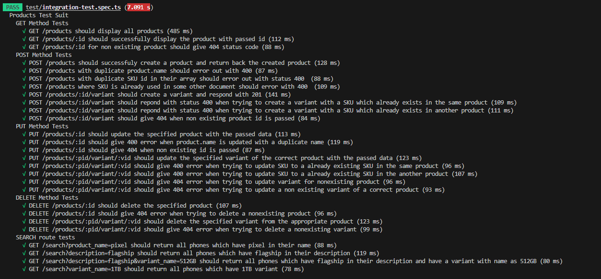

# How to run the app?

## If you have Docker and dockercompose

Its super simple, just type `docker-compose up` and everthing will be up and running

## If you DONT have Docker and dockercompose

- Firstly, make sure you install all the dependencies by running `npm install`.
- Build the project by running `npm run build`
- Make sure you have Mongodb installed and running on port `27017` (default port for mongo). In any case if you are running on a different port, please modify the `MONGO_URI` field in `.env` file to include the port you are using
- Finally start the app by running `npm run start:dev`

If you do not change the MONGO_URI in `docker-compose.yml` or `.env`, the app will automatically create a database called `mirrAR`, and create a collection called `products`. The app will run bydefault on port `8080`

## How to run tests

Just run the command `npm run test` to run the tests. Since all the tests are integration level tests, they call the database. So you will have to keep mongo running. Make sure the MONGO_URI field is correct in the `.env` file incase you face difficulty connecting to the database.

# How do you interact with the API

I have included a Postman collection `Products API.postman_collection.json` which has all the routes exposed by the server along with a short description of what they do.

The very first time you start-up the app, the database will be empty. You can send a request to `GET /resetdb` to get some dummy data populated. You can send request to `GET /resetdb` later aswell to restore the state of the database to this inital data

# Architecture

The app follows the common architecture of most NestJS apps, which is having a controller layer and a service layer. The requests are receieved by the controller layer which in turn call the corresponsing serivce layer function to perform the logic.

For database, MongoDB is used. I do not have a strong reason as to why I went with MongoDB other than the fact that I am comfortable working with it.

The documents are modelled in way, where for each product, it has a array of embedded subdocumets of variants. Hence, there is only one collection, the products colletion since the variants are direclty embeded into the Products. The main reason for going with this embedded apporach instead of having a sepeate colletion of variants and linking the proucts and variants via a reference was, it just seemed overkill. Since every variant is unique anyways and belongs to only a single product, it makes no sense to have seperate collection for the variants. It would just make the process of fetching a entire Product with its variants slow, becuase internally, mongo would have to make multiple calls to aggregrate this data.

For a detailed list of exposed endpoints and their functions, you can go to `http://localhost:8080/api` to get a UI documentaion of the exposed API.

Some assumptions/decisions which I took

- Each product has to have a unique name. There cannot be 2 products with the same name
- The SKU of each variant should be different, regardles if they belong to one single product or different products.
- You should be able to search products by keywords aswell on the `GET /search` endpoint. Like forexample, you can search for the keyword `flagship` in the description and it will return all the phone which have the word flagship in their description.

There are a comprehensive amount of test cases written in-order to ensure these rules are enforced correctly within the app

Below is the list of (almost) all the rules the app follows

